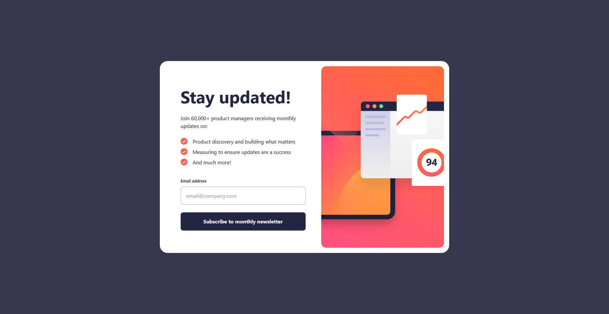

# Newsletter Signup with Success Message

This is a solution to the **Newsletter Sign-up Form with Success Message** challenge on [Frontend Mentor](https://www.frontendmentor.io/challenges/newsletter-signup-form-with-success-message-5PNzgq8cj). The goal of the challenge is to build a responsive newsletter sign-up form with interactive feedback for successful subscriptions.

🔗 **Live Site:** [https://ariarzg-newletter-signup.netlify.app/](https://ariarzg-newletter-signup.netlify.app/)

## 🚀 Features

- Fully responsive design with 3 breakpoints: **Mobile**, **Tablet**, and **Desktop**
- Interactive **success message** after form submission
- **Beautiful hover effects** on inputs and buttons
- Form validation for email input
- Clean, modern UI inspired by the original design

## 🛠️ Technologies Used

- **HTML**
- **CSS**
- **SCSS (SASS)**
- **JavaScript**
- **Vite** (for fast development and bundling)

## 📱 Layouts

| Device  | Layout |
| ------- | ------ |
| Mobile  | ✅     |
| Tablet  | ✅     |
| Desktop | ✅     |

## 📦 Installation & Setup

To run the project locally:

```bash
git clone https://github.com/yourusername/newsletter-signup.git
cd newsletter-signup
npm install
npm run dev
```

> Make sure you have Node.js and npm installed.

## 🖼️ Preview



## 🤝 Contributing

Contributions are welcome! If you'd like to improve the UI, refactor code, or add features, feel free to fork the repo and make a pull request.

## 📄 License

This project is open-source and available under the [MIT License](LICENSE).

---

**Challenge by [Frontend Mentor](https://www.frontendmentor.io/)**  
Coded by [Ariarzg](https://github.com/Ariarzg)
